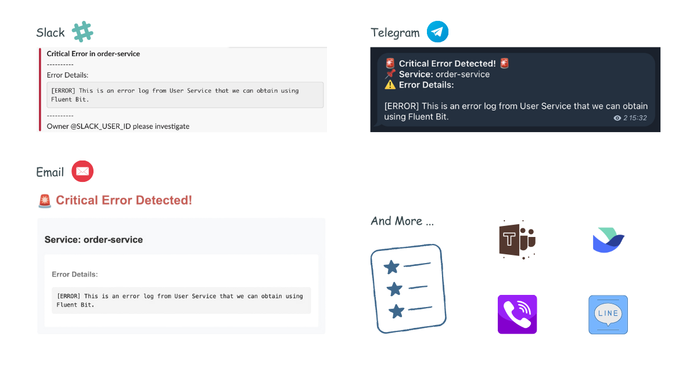

# versus-incident

[versus-incident](https://github.com/VersusControl/versus-incident) - An open-source incident management system with multi-channel alerting capabilities.

```bash
helm repo add unifie https://unifie-cloud.github.io/charts/helm
```

## Features

- 🚨 **Multi-channel Alerts**: Send incident notifications to Slack (more channels coming!)
- 📝 **Custom Templates**: Define your own alert messages using Go templates
- 🔧 **Easy Configuration**: YAML-based configuration with environment variables support
- 📡 **REST API**: Simple HTTP interface to receive alerts



## Environment Variables

The application relies on several environment variables to configure alerting services. Below is an explanation of each variable:

### Common

| Variable     | Description                                                 |
| ------------ | ----------------------------------------------------------- |
| `DEBUG_BODY` | Set to `true` to enable print body send to Versus Incident. |

### Slack Configuration

| Variable           | Description                                            |
| ------------------ | ------------------------------------------------------ |
| `SLACK_ENABLE`     | Set to `true` to enable Slack notifications.           |
| `SLACK_TOKEN`      | The authentication token for your Slack bot.           |
| `SLACK_CHANNEL_ID` | The ID of the Slack channel where alerts will be sent. |

### Telegram Configuration

| Variable             | Description                                     |
| -------------------- | ----------------------------------------------- |
| `TELEGRAM_ENABLE`    | Set to `true` to enable Telegram notifications. |
| `TELEGRAM_BOT_TOKEN` | The authentication token for your Telegram bot. |
| `TELEGRAM_CHAT_ID`   | The chat ID where alerts will be sent.          |

### Email Configuration

| Variable        | Description                                                    |
| --------------- | -------------------------------------------------------------- |
| `EMAIL_ENABLE`  | Set to `true` to enable email notifications.                   |
| `SMTP_HOST`     | The SMTP server hostname (e.g., smtp.gmail.com).               |
| `SMTP_PORT`     | The SMTP server port (e.g., 587 for TLS).                      |
| `SMTP_USERNAME` | The username/email for SMTP authentication.                    |
| `SMTP_PASSWORD` | The password or app-specific password for SMTP authentication. |
| `EMAIL_TO`      | The recipient email address for incident notifications.        |
| `EMAIL_SUBJECT` | The subject line for email notifications.                      |

### AWS SNS Configuration

| Variable                          | Description                                                                                                                                                                                                                                                                                 |
| --------------------------------- | ------------------------------------------------------------------------------------------------------------------------------------------------------------------------------------------------------------------------------------------------------------------------------------------- |
| `SNS_ENABLE`                      | Set to `true` to enable receive Alert Messages from SNS.                                                                                                                                                                                                                                    |
| `SNS_HTTPS_ENDPOINT_SUBSCRIPTION` | This specifies the HTTPS endpoint to which SNS sends messages. When an HTTPS endpoint is configured, an SNS subscription is automatically created. If no endpoint is configured, you must create the SNS subscription manually using the CLI or AWS Console. E.g. `https://your-domain.com` |
| `SNS_TOPIC_ARN`                   | AWS ARN of the SNS topic to subscribe to                                                                                                                                                                                                                                                    |

Ensure these environment variables are properly set before running the application. You can configure them in your `.env` file, Docker environment variables, or Kubernetes secrets.

## Custom Alert Templates

### Slack Template

Create your Slack message template, for example `config/slack_message.tmpl`:

```
*Critical Error in {{.ServiceName}}*
----------
Error Details:
{{.Logs}}
----------
Owner <@{{.UserID}}> please investigate
```

### Telegram Template

For Telegram, you can use HTML formatting. Create your Telegram message template, for example `config/telegram_message.tmpl`:

```
🚨 <b>Critical Error Detected!</b> 🚨
📌 <b>Service:</b> {{.ServiceName}}
⚠️ <b>Error Details:</b>
{{.Logs}}
```

This template will be parsed with HTML tags when sending the alert to Telegram.

### Email Template

Create your email message template, for example `config/email_message.tmpl`:

```
Subject: Critical Error Alert - {{.ServiceName}}

Critical Error Detected in {{.ServiceName}}
----------------------------------------

Error Details:
{{.Logs}}

Please investigate this issue immediately.

Best regards,
Versus Incident Management System
```

This template supports both plain text and HTML formatting for email notifications.

# One click deploy

You can use unifie.cloud to deploy this project to your cluster:

[](https://unifie.cloud/kubernetes/unifie-project-ba4cg56a7f2ya7c8)
